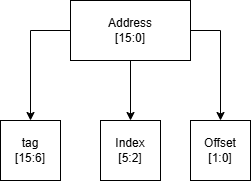
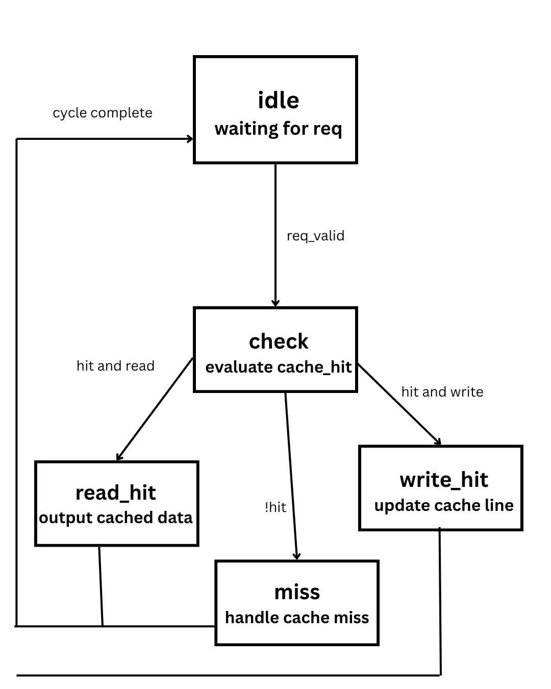
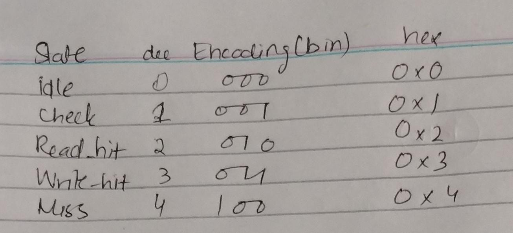
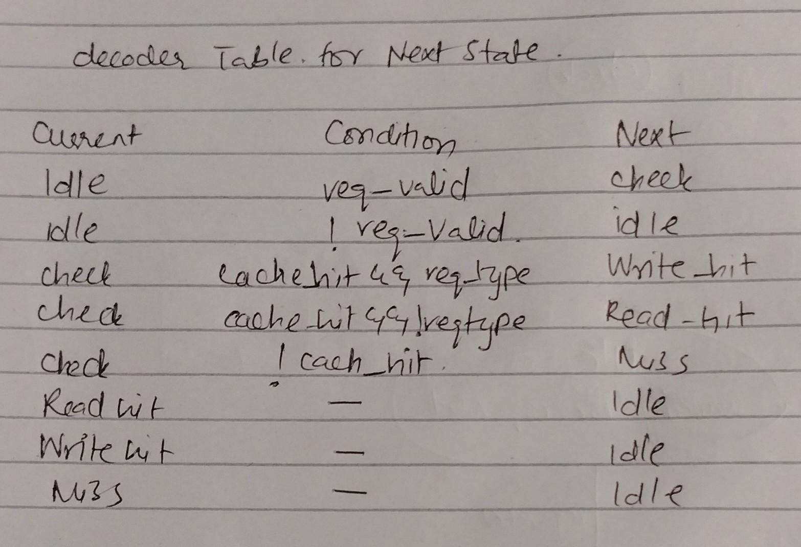
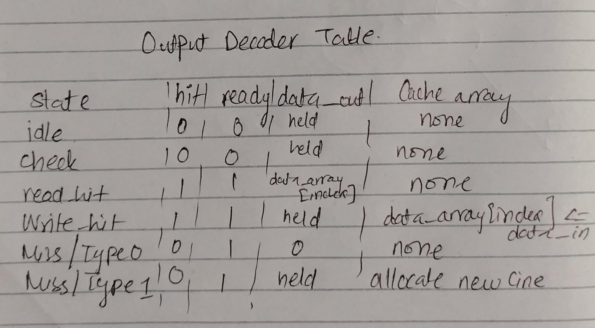
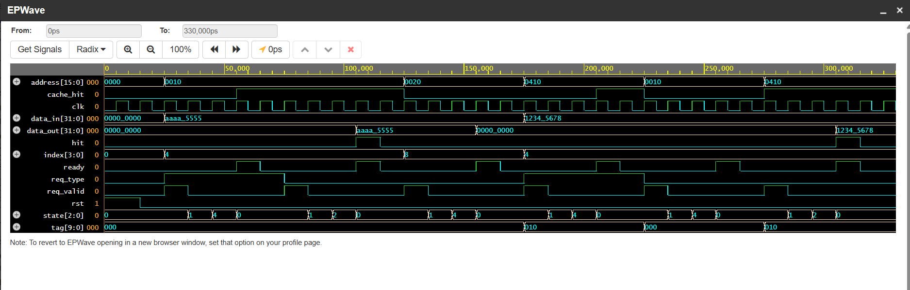

# Direct-Mapped Cache Controller

A parameterized **Direct-Mapped Cache Controller** implemented in **SystemVerilog**. This project demonstrates the fundamental concepts of cache memory, address decoding, cache hit/miss detection, and finite state machine (FSM) based control logic. The controller supports basic read and write operations while using a **Moore Finite State Machine (FSM)** to manage cache requests.

---


# Introduction

Modern processors operate much faster than main memory. If every memory request had to access RAM directly, the processor would spend a significant amount of time waiting for data. To reduce this performance gap, computers use **cache memory**, a small but very fast memory placed between the CPU and main memory.

This project implements a **parameterized direct-mapped cache controller** in SystemVerilog. The controller accepts CPU read and write requests, determines whether the requested data is already available in the cache, and performs the required cache operation.

---

# Why Cache Memory?

Cache memory is used to reduce the average memory access time.

Programs tend to access the same data repeatedly (**temporal locality**) or access nearby memory locations (**spatial locality**). Instead of repeatedly fetching data from slow main memory, frequently used data is stored in a small high-speed cache.

Benefits of cache memory include:

- Faster memory access
- Reduced processor stall cycles
- Improved overall system performance
- Lower average memory latency

Without cache memory, the CPU would have to wait for every memory access to complete from main memory.

---

# What is a Direct-Mapped Cache?

A **direct-mapped cache** is the simplest cache organization.

Each memory block can be stored in **exactly one cache line**. The cache line is determined entirely by the **index bits** of the address.

```
Memory Address
      │
      ▼
+----------------------+
| Tag | Index | Offset |
+----------------------+
        │
        ▼
 Select Cache Line
```


When a CPU request arrives:

1. The index selects one cache line.
2. The stored tag is compared with the requested tag.
3. If both the tag and valid bit match, it is a **cache hit**.
4. Otherwise, it is a **cache miss**.

Although direct-mapped caches are simple and hardware-efficient, multiple memory addresses can map to the same cache line, causing replacements.

---

# Project Overview

This project implements a parameterized direct-mapped cache controller with the following specifications:

| Parameter | Value |
|-----------|------:|
| Address Width | 16 bits |
| Data Width | 32 bits |
| Cache Lines | 16 |
| Index Width | 4 bits |
| Offset Width | 2 bits |
| Tag Width | 10 bits |


These Parameters were determined by:
<div align="center">

</div>
The controller performs:

- Address decoding
- Tag comparison
- Valid-bit checking
- Cache hit detection
- Cache miss detection
- Read operations
- Write operations
- Write allocation on write misses

---

# Features

- Parameterized SystemVerilog design
- Direct-mapped cache organization
- Separate data, tag, and valid-bit arrays
- Address decoding into Tag, Index, and Offset
- Cache hit/miss detection
- Read hit support
- Write hit support
- Write-allocate policy
- Moore FSM based controller
- Waveform verification

---

# Cache Organization

The cache consists of three arrays:

### Data Array

Stores the actual 32-bit data.

```
Cache Line
────────────
Data
```

### Tag Array

Stores the upper address bits used to identify which memory block is currently stored.

```
Cache Line
────────────
Tag
```

### Valid Bit Array

Indicates whether the cache line currently contains valid data.

```
0 → Empty

1 → Valid Data Present
```

---

# Address Breakdown

The 16-bit address is divided into three fields.

```
+------------+---------+--------+
| Tag (10)   |Index(4) |Offset(2)|
+------------+---------+--------+
```
the block diagram is given as for address decoding:
<div align="center">

</div>
### Tag (10 bits)

Used to uniquely identify a memory block.

### Index (4 bits)

Selects one of the 16 cache lines.

### Offset (2 bits)

Specifies the byte position inside the 32-bit word.

Since each cache line stores one word, the offset is not used further in this implementation.

---

# FSM Design

The controller is implemented using a **Moore Finite State Machine (FSM)**.

The FSM contains five states:

- IDLE
- CHECK
- READ_HIT
- WRITE_HIT
- MISS


<div align="center">

</div>

The state encoder is given as :
<div align="center">

</div>

next state logic is as follows:
<div align="center">

</div>

and output is determined as:
<div align="center">

</div>

# Why a Moore FSM?

A **Moore FSM** was chosen because its outputs depend only on the **current state**, not directly on the inputs.

This provides several advantages:

- Simpler state transitions
- Stable outputs
- Reduced chance of glitches
- Easier debugging
- Cleaner hardware implementation

For example:

- In the **READ_HIT** state, the controller outputs the cached data and asserts both `hit` and `ready`.
- In the **WRITE_HIT** state, the cache is updated before asserting completion.
- In the **MISS** state, the controller reports a cache miss and performs write allocation if required.

Since outputs are associated with states rather than input changes, the design is predictable and easier to verify.

---

# Cache Operation

## Read Request

1. CPU sends a read request.
2. Address is decoded into Tag, Index, and Offset.
3. Valid bit and stored tag are checked.
4. If they match:
   - Cache Hit
   - Data returned to CPU.
5. Otherwise:
   - Cache Miss
   - Data unavailable (no main memory implemented).

---

## Write Request

1. CPU sends a write request.
2. Address is decoded.
3. Cache line is checked.
4. If the address already exists:
   - Cache line is updated.
5. If the address is absent:
   - A new cache line is allocated.
   - Tag and valid bit are updated.
   - Data is stored.

This implementation therefore follows a **Write-Allocate** policy.

---

# Verification

A self-checking SystemVerilog testbench was developed to verify the controller.

The following test cases were performed:

- Write data to an empty cache line.
- Read the same address and verify a cache hit.
- Read an empty cache line and verify a cache miss.
- Write a different address that maps to the same cache index.
- Verify cache replacement.
- Read the new address and verify successful replacement.

Each test automatically prints **PASS** or **FAIL**, and the simulation waveform confirms the expected FSM transitions and cache behavior.

---
# Waveform

The simulation waveform confirms the correct operation of the direct-mapped cache controller by showing the interaction between the CPU requests, the cache controller FSM, and the cache memory. Every request begins when the CPU asserts req_valid, causing the FSM to leave the IDLE state and enter the CHECK state. During this state, the controller decodes the address into tag, index, and offset, compares the requested tag with the stored tag, and checks the corresponding valid bit to determine whether the request is a cache hit or a cache miss.

The first transaction is a write to address 0x0010. Since the cache is initially empty, the controller detects a cache miss. Following the write-allocate policy, it allocates the cache line, stores the data 0xAAAA5555, updates the corresponding tag, and sets the valid bit.

The second transaction reads the same address (0x0010). This time, both the tag and valid bit match, producing a cache hit. The FSM enters the READ_HIT state, asserts the hit and ready signals, and returns the stored value 0xAAAA5555 on data_out.

The third transaction accesses address 0x0020, which maps to a different cache line that has not been initialized. The valid bit is still zero, resulting in a cache miss. Since the project does not implement a main memory interface, the controller returns zero on data_out while indicating a miss.

The fourth transaction writes 0x12345678 to address 0x0410. Although this address has a different tag, it maps to the same cache index as 0x0010. Because the cache is direct mapped, the new data replaces the old cache line, demonstrating the replacement behavior of a direct-mapped cache.

Finally, the fifth transaction reads address 0x0410. The stored tag now matches the requested tag, producing a cache hit. The controller enters the READ_HIT state and returns the newly stored value 0x12345678, confirming that the replacement operation was successful.

Throughout the waveform, the state signal clearly shows the Moore FSM transitioning through IDLE → CHECK → READ_HIT/WRITE_HIT/MISS → IDLE, while the tag, index, cache_hit, hit, ready, and data_out signals verify that address decoding, hit detection, and cache operations are functioning correctly. Together, the waveform confirms that the cache controller correctly implements direct-mapped cache behavior with a write-allocate policy and a Moore FSM.
<div align="center">

</div>

# Conclusion

This project successfully implements a **parameterized Direct-Mapped Cache Controller** in SystemVerilog using a **Moore FSM**. The design performs address decoding, tag comparison, valid-bit verification, and cache hit/miss detection while supporting basic read and write operations. A write-allocate policy is implemented for write misses, and the controller is verified using a self-checking testbench and simulation waveforms.

The project provides a practical understanding of cache organization, memory hierarchy, and finite state machine design, serving as a strong foundation for more advanced cache architectures.

All the simulation was done on eda playground
link: https://www.edaplayground.com/x/7Qb5