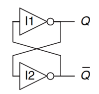
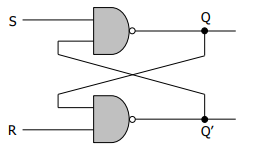
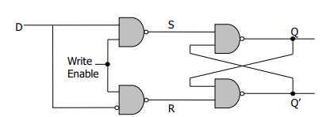
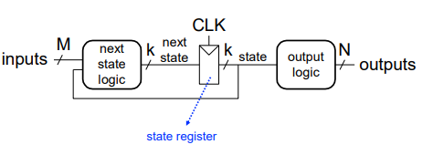

# Lecture 3 – Sequential Logic and FSMs

## Core Topics
explains basic storage elements such as latches and flip-flops, along with how registers and memory arrays are built from them. The discussion then moves to the difference between sequential and combinational logic, highlighting how sequential systems depend on both current inputs and past states. It also covers clocks and synchronous systems, which coordinate when changes in state occur. Finally, it introduces Finite State Machines (FSMs), including the differences between Moore and Mealy models, as well as how FSMs are implemented using state encoding techniques.

---

## High-Level Summary
Combinational logic has no memory, meaning its output depends only on the current inputs. However, to build real computers, circuits must be able to store past information, which leads to the development of sequential logic. Sequential logic combines combinational logic with storage elements and a clock to manage when changes occur. Finite State Machines (FSMs) provide a formal way to design systems with memory, and they are widely used in applications such as processors and controllers.

---

## Combinational vs Sequential Logic

| Feature | Combinational | Sequential |
|--------|--------------|------------|
| Memory | No | Yes |
| Output depends on | Current inputs | Inputs + past state |
| Examples | AND, OR, MUX | Register, Counter, FSM |

---

## Basic Storage Elements

### 1. Cross-Coupled Inverters
- Two stable states: Q = 0 or 1
- No control input -> not practical alone

---

### 2. R-S Latch (Reset-Set)
- Built from NAND gates

| S | R | Q |
|--|--|--|
| 0 | 1 | 1 (Set) |
| 1 | 0 | 0 (Reset) |

- Forbidden: S = 0, R = 0
- Can cause metastability

---

### 3. Gated D Latch
- Controlled by Write Enable (WE)

| WE | D | Q(next) |
|----|---|---------|
| 0 | X | Q(prev) |
| 1 | 0 | 0 |
| 1 | 1 | 1 |

- WE = 1 -> transparent
- WE = 0 ->holds value

---

### 4. D Flip-Flop
- Built from two latches (master-slave)
- Edge-triggered (changes on clock edge)
- Stable output during clock cycle

**Key Difference**
- Latch: level-sensitive
- Flip-flop: edge-triggered

---

## Registers and Memory

### Register
Multiple flip-flops that share a common clock are used together to store multiple bits of information at the same time. This arrangement allows data to be stored in parallel, forming the basis of registers and small memory units in digital systems.

### Memory Array
- Organized as locations * bits

Key concepts:
- Address space = number of locations
- Addressability = bits per location

Operations:
- Decoder selects location
- Multiplexer outputs data

Example:
- 4 locations * 3 bits
- 2 address bits required

---

## Clocks and Synchronous Systems

- Clock signal alternates between 0 and 1
- Clock cycle = time between rising edges

### In Synchronous Systems
- State changes only at clock edge
- Logic evaluates during cycle
- Clock period >= maximum logic delay

### Asynchronous Systems
- No clock
- Harder to design

---

## Finite State Machines (FSM)
A Finite State Machine (FSM) is a mathematical and digital design model used to represent systems that have a limited number of states and can change from one state to another based on inputs.
In simple terms, an FSM is a system that remembers where it is (its current state) and moves between states depending on inputs and a clock signal.

### Components
- State Register (flip-flops)
- Next State Logic
- Output Logic

### Structure
- Inputs -> Next State Logic -> State Register -> Outputs

---

## State Diagrams
- Circles represent states
- Arrows represent transitions
- Labels show input conditions

---

## Example: Traffic Light Controller (Moore FSM)

States:
- S0: Green (A green, B red)
- S1: Yellow (A yellow, B red)
- S2: Red (A red, B green)
- S3: Red + Yellow

Inputs:
- T_A (traffic on A)
- T_B (traffic on B)

Behavior:
- Stay in green if no traffic
- Otherwise cycle through states

---

## FSM Design Procedure

1. Identify states
2. Draw state diagram
3. Create transition table
4. Create output table
5. Choose encoding
6. Derive Boolean equations
7. Implement with flip-flops and logic

---

## State Encoding Tradeoffs

| Encoding | Bits | Flip-Flops | Logic Complexity | Best Use |
|----------|-----|-----------|------------------|----------|
| Binary | log₂(N) | Fewest | Complex | Minimal hardware |
| One-hot | N | Most | Simple | FPGAs |
| Output-encoded | Outputs | Medium | Medium | Moore FSMs |

---

## Moore vs Mealy FSMs

| Feature | Moore | Mealy |
|--------|------|--------|
| Output depends on | State only | State + inputs |
| Output timing | After clock edge | Immediate |
| States | More | Fewer |
| Stability | More stable | Can glitch |

Rule:
- Use Moore for simplicity
- Use Mealy for speed/efficiency

---

