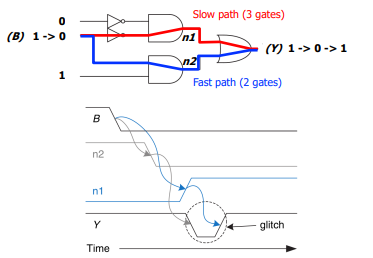
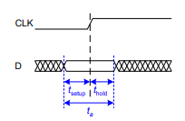
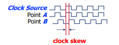
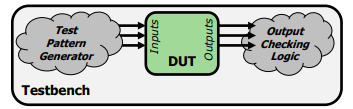

# Lecture 6: Timing and Verification II – Summary Notes

## Part 1: Combinational Circuit Timing

### 1.1 The Reality of Delay
The idea that digital logic changes instantly is only an abstraction and is not true in real hardware. In reality, transistors take a finite amount of time to switch states due to physical limitations such as capacitance and resistance in the circuit. Even the speed of light places a limit on how fast signals can travel, which is significant at the chip scale since signals only travel about 30 cm per nanosecond.

### 1.2 Delay Definitions
- **Contamination delay (`tcd`)** – minimum time until output *starts* changing.
- **Propagation delay (`tpd`)** – maximum time until output *finishes* changing.
- Delays depend on:
  - Rising vs. falling transitions
  - Different input paths
  - Temperature, voltage, aging

### 1.3 Critical Path & Shortest Path
- **Critical (longest) path** = sum of `tpd` along worst-case route -> determines **maximum clock frequency**.
- **Shortest path** = sum of `tcd` -> determines **hold time vulnerability**.
- Example: `tpd = 2*tpd_AND + tpd_OR`, `tcd = tcd_AND`

### 1.4 Glitches
A glitch occurs when a single input transition causes multiple unwanted transitions in the output before the signal settles to its final stable value. This phenomenon is often visible in Karnaugh maps when moving between prime implicants, where timing differences in signal paths lead to temporary inconsistencies. Glitches can be reduced or eliminated by adding consensus terms to the logic expression, although this usually increases circuit area and power consumption. In many cases, glitches are ignored if only the steady-state output is important, leaving it as a design choice depending on the application requirements.

---

## Part 2: Sequential Circuit Timing

### 2.1 Flip-Flop Timing Parameters
- **`tsetup`** – D must be stable *before* clock edge.
- **`thold`** – D must be stable *after* clock edge.
- **Aperture time** = `tsetup + thold`
- **Metastability** – if D changes during aperture time, output can settle unpredictably.

### 2.2 Clock-to-Q Delays
- **`tccq`** (contamination) – earliest Q changes after clock edge.
- **`tpcq`** (propagation) – latest Q stabilizes after clock edge.

### 2.3 System Timing Constraints (Two Flip-Flops with Logic)
- **Setup constraint (max delay):**  
  `Tc > tpcq + tpd + tsetup`  
  -> Determines **minimum clock period** (max frequency).
- **Hold constraint (min delay):**  
  `tccq + tcd > thold`  
  -> If violated, data changes too fast for next flip-flop.

### 2.4 Fixing Violations
Timing violations in digital circuits can be fixed depending on their type. For a setup violation, the designer can reduce the logic depth, simplify long combinational paths, or lower the clock frequency so that all signal delays fit within one clock cycle. In contrast, a hold violation is fixed by adding buffers to short paths, which increases the contamination delay (tcd) but does not affect the maximum clock frequency of the system.

### 2.5 Clock Skew
Occurs because the clock signal does not reach all flip-flops at exactly the same time. The skew is defined as the time difference between clock edges arriving at different registers. This effectively increases the required setup and hold times, adding extra timing overhead to the design. To minimize these issues, clock distribution is carefully engineered using structures like clock trees or clock meshes.

---

## Part 3: Circuit Verification Overview

### 3.1 Two Main Questions
1. Is it **functionally correct**?
2. Does it meet **timing constraints**?

### 3.2 Verification Tools
- **Formal verification** (SAT solvers)
- **HDL simulation** (Vivado, ModelSim)
- **Circuit simulation** (SPICE)

### 3.3 Practical Split-Responsibility Approach
- **High-level (C/HDL):** check only functionality (fast simulation).
- **Low-level (circuit):** check only timing/power, plus functional equivalence to high-level model.

---

## Part 4: Functional Verification

### 4.1 Testbench Concept
Functional verification is done using a testbench, which is a special module designed to test a Device Under Test (DUT). The testbench applies inputs to the DUT and checks whether the outputs behave as expected. Unlike real hardware design, a testbench is not synthesized into physical hardware; instead, it is used only for simulation purposes. It can also use simulation-only constructs such as timing delays like #10 and system tasks like $display to help observe and debug the behavior of the design.

### 4.2 Testbench Types

| Type | Input Generation | Error Checking |
|------|----------------|----------------|
| Simple | Manual | Manual (waveforms) |
| Self-Checking | Manual | Automatic |
| Testvector-based | File | Automatic |
| Automatic | Generated | Automatic (vs golden model) |

### Types

A simple testbench uses hardcoded inputs and timing delays, with outputs checked manually through waveforms or $display. It is easy to write and good for small corner cases, but not scalable. A self-checking testbench adds automatic error checking using conditions like if (y != expected), reducing manual work, though it can still be limited in scalability and may contain bugs.

A testvector-based testbench reads inputs and expected outputs from a file using $readmemb and applies them using a clock, making it easier to update test cases without changing code. However, it depends on external files and test vector generation. An automatic testbench with a golden model compares the DUT against a verified reference model using the same inputs, enabling full automation and high coverage, but it requires a correct golden model and good input generation.

### 4.7 The Verification Wall
- 32-bit adder: 64 inputs -> 2^64 possible combinations.
- Testing 1 input/ns -> **58.5 years** to test all.
- Must use **pruning**, **formal methods**, or **constrained-random** testing.

---

## Part 5: Timing Verification

### 5.1 Two Approaches
- **High-level simulation** with `#delay` statements – fast, but timing is approximate.
- **Circuit-level timing verification** – accurate, but requires synthesized design.

### 5.2 Role of Tools (e.g., Vivado)
- Tools attempt to **meet timing automatically** for given clock constraint.
- Output: timing report with worst-case paths, max frequency, and violations.

### 5.3 Common Failures
- Desired clock frequency too aggressive -> setup violation.
- Excessive clock skew -> hold violation (harder to fix post-fabrication).
- Asynchronous logic issues.

### 5.4 Fixing Timing Errors (Manual Iteration)
- Try different synthesis/place-and-route options (random seeds, hints).
- Manually optimize critical paths:
  - Simplify logic.
  - Split long combinational chains.
  - Add buffers to fix hold violations.

### 5.5 Good Design Principles
- **Critical path design:** minimize maximum logic delay -> maximize performance.
- **Balanced design:** equalize delays across paths -> avoid bottlenecks.
- **Optimize common case** – but ensure corner cases still work.

---

## Key Formulas to Remember

| Constraint | Formula |
|------------|---------|
| Setup (max freq) | `Tc > tpcq + tpd + tsetup` |
| Hold (min delay) | `tccq + tcd > thold` |
| Clock skew effect | Increases effective `tsetup` and `thold` |

---