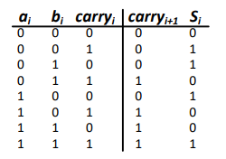
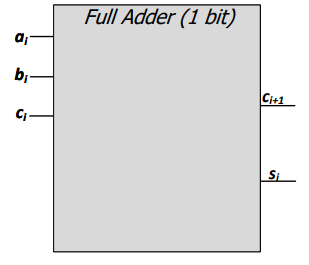

# Combinational Logic – Lecture Notes

## Core Topic
Sequential logic and combinational logic are two fundamental types of digital logic circuits. In combinational logic, the output depends only on the current inputs, meaning the circuit has no memory and does not store past information. Examples include adders, multiplexers, and logic gates. In contrast, sequential logic depends not only on the current inputs but also on the previous state of the circuit. Because of this, sequential circuits have memory elements that allow them to store information over time. Examples include flip-flops, registers, and counters.

---

## 1. Building Blocks of Computers
- All computers are built from:
  - Transistors → Logic Gates → Combinational Circuits
- Two main transistor types:
  - **nMOS** (good at pulling down to 0)
  - **pMOS** (good at pulling up to 1)
- CMOS gates use:
  - Pull-up network (pMOS)
  - Pull-down network (nMOS)

---

## 2. Logic Gates & Boolean Algebra
### Basic Gates:
- NOT, AND, OR, NAND, NOR, XOR

### DeMorgan’s Laws:
- (X + Y)' = X' · Y'
- (X · Y)' = X' + Y'

---

## 3. Combinational vs Sequential Logic
- **Combinational Logic:**
  - Output depends only on current inputs
  - No memory
- **Sequential Logic:**
  - Output depends on current inputs + past state
  - Has memory

---

## 4. Standard Functional Forms (Canonical)
- **Sum of Products (SOP):**
  - OR of AND terms (minterms)
- **Product of Sums (POS):**
  - AND of OR terms (maxterms)

- **Minterm:**
  - Product including all input variables
- **Maxterm:**
  - Sum including all input variables

---

## 5. Logic Minimization
Logic minimization is the process of simplifying Boolean expressions while still producing the same logical function. A single logic function can often be represented using multiple Boolean expressions, but some forms are more efficient than others. Simplifying logic helps reduce hardware cost, improve circuit speed, and lower power consumption. Common methods used for logic minimization include Boolean algebra and Karnaugh Maps (K-maps), which help identify and eliminate unnecessary terms in a logic expression.

---

## 6. Important Combinational Building Blocks

| Block | Function |
|------|--------|
| Decoder | n inputs -> 2^n outputs, one HIGH at a time |
| Multiplexer (MUX) | Selects 1 of N inputs |
| Full Adder | Adds 3 bits -> sum + carry |
| PLA | Implements SOP using AND + OR arrays |
| ALU | Performs arithmetic & logic operations |
| Tri-State Buffer | Output = 0, 1, or Z (high impedance) |

---

## 7. ALU Example Operations
- 000 ->A AND B  
- 001 ->A OR B  
- 010 ->A + B  
- 110 -> A – B  
- 111 -> SLT (set less than)

---

## 8. Moore’s Law & Enabling Technologies
- Transistor count doubles every ~2 years
---

## 9. Power & Performance
- **Dynamic Power:**
  - P = C * V^2 * f
- **Static Power:**
  - P = V * I_leakage
- Series transistors → slower than parallel

---

## Must-Remember Formulas

### Full Adder:

- Sum = A ⊕ B ⊕ Cin  
- Carry_out = AB + ACin + BCin  

### DeMorgan’s Laws:
- (X + Y)' = X' · Y'  
- (X · Y)' = X' + Y'  

### Canonical Forms:
- SOP: F = Σ m(indices where output = 1)
- POS: F = Π M(indices where output = 0)

---

## Common Simplification Theorems
- X + 0 = X  
- X + 1 = 1  
- X + X = X  
- X + X' = 1  
- X · X' = 0  
- X + XY = X (absorption)

---

## Why CMOS Uses Both nMOS & pMOS

CMOS uses both nMOS and pMOS transistors because each transistor type has its own strengths and weaknesses. An nMOS transistor is good at passing a logic 0 but weak at passing a logic 1, while a pMOS transistor is good at passing a logic 1 but weak at passing a logic 0. By combining both in a complementary design, CMOS circuits produce clean and reliable outputs while preventing short circuits and avoiding floating output states.

---

##  Logical Completeness
- {AND, OR, NOT} -> complete
- NAND alone -> complete
- NOR alone -> complete

