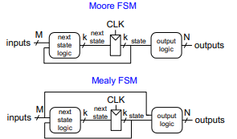
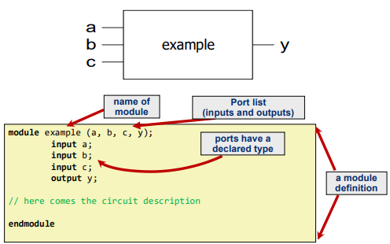

# Lecture 4: Sequential Logic, FPGAs & Verilog

---

## Lecture 4a: Sequential Logic Design II - Finite State Machines (FSMs)

### Previously
Sequential circuits are digital systems where the output depends not only on the current inputs but also on past inputs, meaning they rely on a stored state to function. Unlike combinational logic, they include memory elements such as latches and flip-flops to retain information over time. One important example is the D flip-flop, an edge-triggered device that captures the input D at the rising edge of the clock signal. Once captured, it stores this value and keeps the output Q stable for the entire clock cycle until the next clock edge updates it again.

---

### Finite State Machine (FSM) Structure

An FSM (Finite State Machine) consists of three main components that work together to control its behavior. The first is the state register, which stores the current state of the system and is typically implemented using flip-flops. The second is the next state logic, which is combinational logic that determines what the next state will be based on the current state and the inputs. The third component is the output logic, which generates the outputs of the system according to the state (and sometimes the inputs, depending on the FSM type).


---

### Moore vs. Mealy FSMs

#### Moore Machine
- Outputs depend **only on current state**

#### Mealy Machine
- Outputs depend on:
  - Current state
  - Inputs
<div align="center">

</div>

---

### State Encoding Schemes

#### Binary (Fully Encoded)
- Uses `log2(number_of_states)` bits
- Pros:
  - Fewer flip-flops
- Cons:
  - More complex logic

#### One-Hot Encoding
- Uses `number_of_states` bits
- Only one bit is `1` at a time
- Pros:
  - Simple logic
- Cons:
  - More flip-flops

#### Output Encoding
- Outputs encoded directly in state bits
- Used in **Moore machines only**
- Minimizes output logic

---

## Lecture 4b: Introduction to FPGAs & Labs

### What is an FPGA?
A Field-Programmable Gate Array (FPGA) is a reconfigurable hardware device that can be programmed after manufacturing to implement custom digital circuits. Instead of being fixed for a single function like traditional hardware, an FPGA can be configured and reconfigured to perform different tasks based on user requirements.

---

### Key Building Blocks
- **Look-Up Tables (LUTs)** -> Implement logic
- **Programmable switches** -> Connect components

---

### Advantages & Disadvantages

#### Advantages
- High performance for specialized tasks
- Energy efficient
- Low development cost
- Fast time-to-market
- Reconfigurable after deployment

#### Disadvantages
- Slower than custom ASICs
- Higher area usage
- Added latency due to flexibility

---

### FPGA Applications
- Deep learning (Microsoft Brainwave)
- Cloud acceleration (AWS F1)
- Genomics (DRAGEN)
- Climate modeling
- Memory research (RowHammer, RowPress)
- Architecture prototyping (PiDRAM, MetaSys)


## Lecture 4c: Hardware Description Languages (HDL) and Verilog

Hardware Description Languages (HDLs) such as Verilog and VHDL are used to describe digital hardware systems. They allow engineers to model, simulate, and synthesize electronic circuits before they are physically built. HDLs are essential in modern electronics because they make it possible to design and manage extremely complex systems containing billions of transistors.

---

### Verilog Module
A Verilog module is the basic building block of hardware design in Verilog. It defines a specific part of a digital system and includes a module name, input and output ports, and the internal logic that describes how the circuit behaves.
<div align="center">

</div>

---

### Hierarchical Design
Hierarchical design is an approach where complex systems are built by combining smaller, simpler modules. This method makes designs easier to understand, improves readability, and allows better scalability. It also simplifies debugging because each module can be tested and verified independently.

---

### Structural vs. Behavioral Modeling

#### Structural (Gate-Level)
- Connects:
  - Gates
  - Lower-level modules

#### Behavioral
- Describes functionality using:
  - `assign`
  - `if`
  - `case`
- Most commonly used approach

---

### Key Verilog Constructs

#### assign
- Continuous assignment
- Used for **combinational logic**

#### always Block
- Executes when signals in sensitivity list change

Examples:
```verilog
always @(posedge clk)
always @(*)