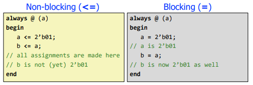

# Lectures 5 & 6: Timing, Verification & Verilog (The Simple Version)

In real-world digital systems, timing actually matters a lot because digital logic is not instantaneous. Gates take time to respond, wires introduce delays, and every operation has some propagation delay. This means that even if a circuit is logically correct on paper, it can still fail in practice if the clock speed is too high, since signals may not have enough time to settle before the next operation begins.

## Part 2: The Two Key Delays

- **Propagation Delay (tpd):** When the output is *finally done changing* (max delay).
- **Contamination Delay (tcd):** When the output *starts changing* (min delay).

**Easy way to think about it:**
- tcd -> first movement
- tpd -> everything settled

## Part 3: The Two Timing Rules (YOU NEED THESE)

### Rule 1: Setup Time (don’t be late)

- Flip-flop needs data **before** the clock edge.
- If data comes late -> boom, wrong value.

- Formula:
  `Clock Period > tpcq + tpd + tsetup`

- If it breaks:
  - slow down clock  
  - or simplify your logic (shorten path)

---

### Rule 2: Hold Time (don’t be too fast)

- Data changes *too quickly* and messes up the next flip-flop.

- Formula:
  `tccq + tcd > thold`

- If it breaks:
  - add buffers (literally slow things down)

---

- **Golden rule:**  
    - Setup = max delay issue  
    - Hold = min delay issue  

## Part 4: Glitches & Skew (the annoying stuff)

Glitches are temporary unwanted changes in a digital circuit’s output, where the signal may flicker or behave unpredictably for a short moment before settling to its correct value. They are usually harmless and often ignored unless they affect system behavior or cause errors in critical designs. Another important issue is clock skew, which occurs when the clock signal does not reach all flip-flops at the same time. This timing difference can make it harder to satisfy timing requirements and can lead to incorrect circuit operation if not properly managed.
## Part 5: Verilog (actual usable version)

### Two ways to write it

1. **Structural**
   - Basically wiring diagram
   - “this connects to that”

2. **Behavioral**
   - More like instructions
   - “if this happens, do that”
   - This is what you’ll mostly us

---

### Blocking vs Non-Blocking (SUPER IMPORTANT)

- **Blocking (`=`):**
  - happens immediately, in order
  - use for combinational logic

- **Non-blocking (`<=`):**
  - everything updates together later
  - use for sequential logic (clocked stuff)
<div align="center">

</div>

**Just remember:**
- no clock -> `=`
- clock -> `<=`

---
### Output Logic
- `assign` (Moore)
- or combinational logic (Mealy)

---

## Part 6: Testing 

Testing is a crucial part of digital design because hardware cannot be verified by intuition alone, so it must be properly tested to ensure it works correctly. A simple testbench is often used first, where different input values are applied and the output waveforms are observed, which is usually sufficient for small or basic designs. However, a more advanced approach is self-checking, where the testbench automatically verifies whether the output is correct and reports errors, making it much more reliable. An even stronger method is the golden model approach, where a simplified and trusted version of the design is created, and the actual circuit’s outputs are compared against it automatically to ensure correctness. 

---

### Reality Check
- Testing all inputs for a 32-bit adder = `2⁶⁴` cases  
 That’s basically impossible → test smart, not everything  

---

## Part 7: What actually matters (cheat sheet)

| Problem              | Cause            | Fix                          |
|---------------------|------------------|------------------------------|
| Circuit too slow    | Setup violation  | shorten path / reduce clock  |
| Random wrong data   | Hold violation   | add buffers                  |
| Output flickering   | Glitch           | usually ignore               |
| Clock mismatch      | Skew             | fix clock design             |
---

### FSM (3-block pattern you will see everywhere)


1. **State register**
`   -   ```verilog
    -   always @(posedge clk)
    -       state <= nextstate;
    
2. **Next State Logic**
    -```verilog
    -always @(*) begin
    -    case(state)
---
